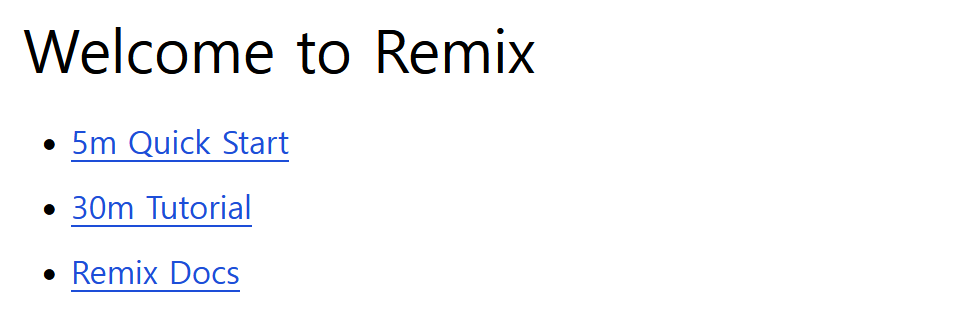

> Remix는 사용자 인터페이스에 집중하고 웹 표준을 통해 작업하여 빠르고 원활하며 탄력적인 사용자 경험을 제공할 수 있는 풀 스택 웹 프레임워크입니다.
> 사람들은 당신의 제품을 사용하는 것을 좋아할 것입니다. -- [Remix](https://remix.run)

새로운 프레임워크를 사용하여 최대한 빠르게 코드를 실행하려면, 기본 구조에 익숙해져야 합니다.
프레임워크의 설치, 주요 기능들의 설정, 빌드 및 실행 방법 등을 파악해야 합니다.
이 때 세세한 기능까지 살펴보지는 않아도 됩니다. 필요할 때 고민해도 늦지 않습니다.

`Remix` 는 [React](https://ko.react.dev/) 기반의 웹 프레임 워크이며, 몇 가지 주요 특징이 있습니다.

SSR (Server Side Rendering) 방식을 사용합니다.
CSR (Client Side Rendering) 방식에 비해 여러 장점들이 있습니다.
서버에서 렌더링 된 HTML 을 제공하여 더욱 빠르게 페이지 로딩을 합니다.
완전한 HTML 을 제공하기 때문에 검색 엔진 최적화 (SEO) 에 용이합니다.
스크립트 코드를 노출하지 않아 보안을 강화합니다.

Routing 은 폴더 구조를 사용합니다.
URL 경로와 같은 이름의 파일을 사용합니다.

기본 빌드 도구로 Vite 를 사용합니다.
Webpack, Parcel 등의 번들링 도구 대비 매우 빠른 빌드 속도를 보입니다.
Remix 와 와 통합되어 있어, 빌드 설정을 바꿀일이 거의 없습니다.

기본 CSS 프레임워크로 Tailwind CSS 를 사용합니다.
미리 셋팅한 유틸리티 클래스를 사용함으로써 빠르게 스타일링 할 수 있습니다.


## 설치하기

`create-remix` 명령을 사용하여, 초기 프로젝트를 생성합니다.

```bash
$ npx create-remix@latest
```

프로젝트를 생성할 경로를 입력합니다.

```
dir   Where should we create your new project?
      ./first-remix
```

소소코드의 관리는 Git 으로 합니다.

```
git   Initialize a new git repository?
      Yes
```

의존성 있는 패키지를 추가 설치 합니다.

```
deps   Install dependencies with npm?
       Yes
```


## 빌드 하고 실행하기

`build` 명령을 사용하여, 빌드합니다.

```
$ npm run build
```

`dev` 명령을 사용하여, 서비스를 실행합니다.
`remix-server` 가 기본설치 되어 있으며, `express` 서버로 변경 가능합니다.

```
$ npm run dev

  ➜  Local:   http://localhost:5173/
  ➜  Network: use --host to expose
  ➜  press h + enter to show help
```

<http://localhost:5173> 에서 다음과 같은 페이지를 볼 수 있습니다.




## 라우팅

`app/routes` 폴더에서 페이지를 관리합니다.

```
app/
├── routes/
│   ├── _index.tsx
│   ├── about.tsx
│   ├── concerts._index.tsx
│   ├── concerts.$city.tsx
│   ├── concerts.trending.tsx
│   └── concerts.tsx
└── root.tsx
```

각 페이지와 경로, 레이아웃은 다음과 같은 규칙으로 맵핑합니다.

```
| URL                     | 일치하는 경로                    | 레이아웃                |
| /                       | app/routes/_index.tsx            | app/root.tsx            |
| /about                  | app/routes/about.tsx             | app/root.tsx            |
| /concerts               | app/routes/concerts._index.tsx   | app/routes/concerts.tsx |
| /concerts/trending      | app/routes/concerts.trending.tsx | app/routes/concerts.tsx |
| /concert/salt-lake-city | app/routes/concerts.$city.tsx    | app/routes/concerts.tsx |
```


## 참고

-   [Remix - Quick Start (5m)](https://remix.run/docs/en/main/start/quickstart)
-   [Remix Tutorial (30m)](https://remix.run/docs/en/main/start/tutorial)

