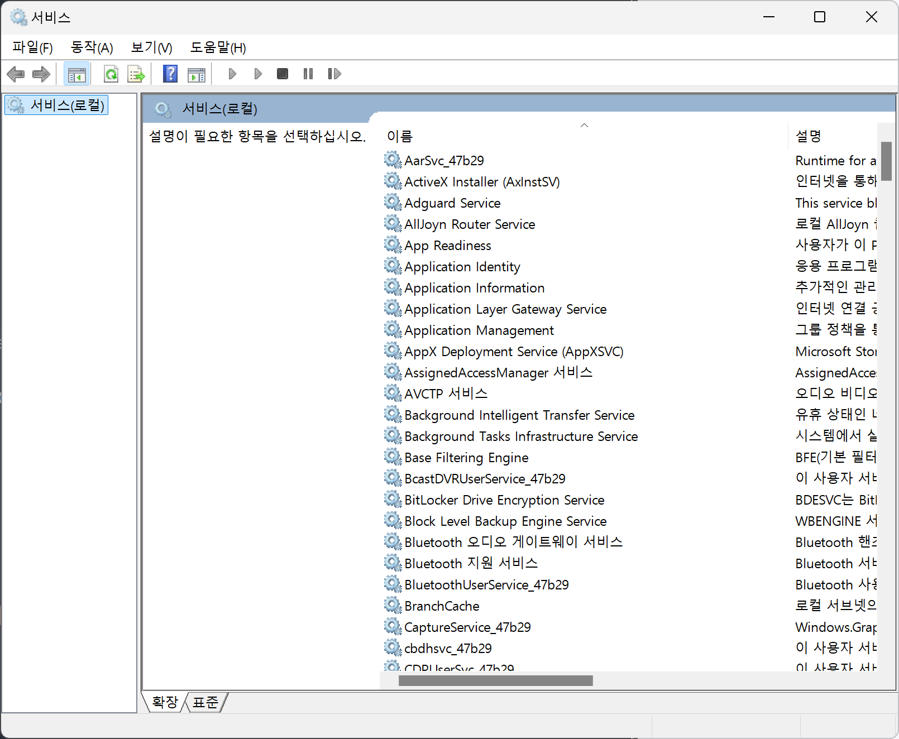
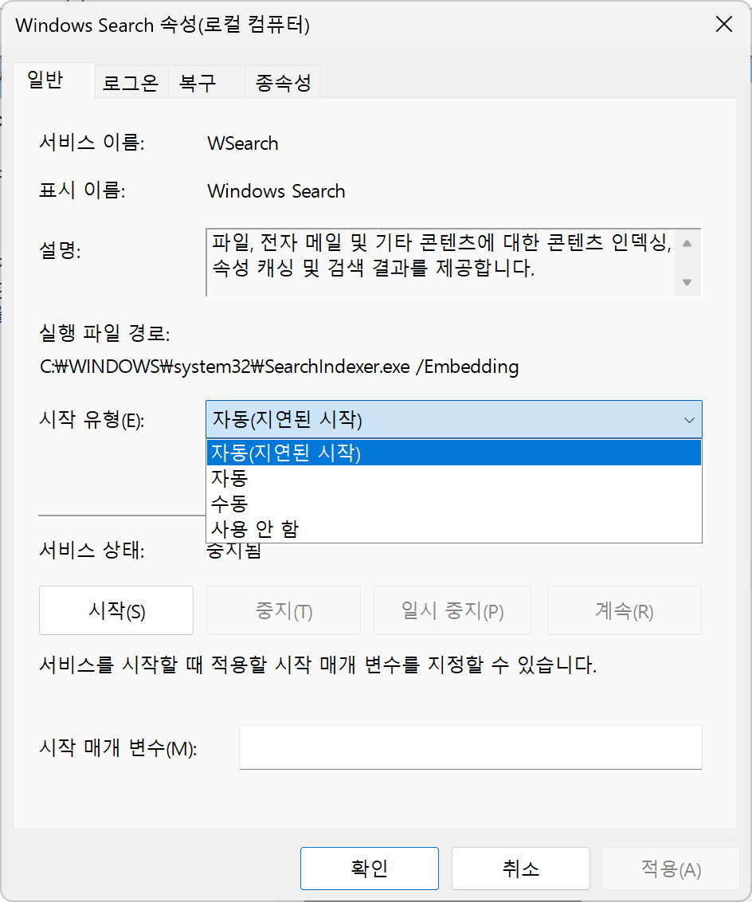

Windows Search 는 사용자 PC 내에 존재하는 이메일, 연락처, 일정, 문서, 사진 등의 데이터 검색을 위한 검색 엔진입니다.


## Windows 서비스를 사용하여 관리하기


### 서비스 관리자 실행하기

`Window` 키를 눌러 `sevice` 를 입력합니다.


`서비스` 를 실행합니다.




### Windows Search 서비스 비활성화 하기

`Windows Search` 항목을 더블 클릭하여, 속성창을 실행합니다.



`시작유형:` 에서 `사용 안 함` 으로 변경하고, 확인 버튼을 클릭합니다.

`서비스 상태:` 에서 현재 상태 확인 할 수 있습니다.

아래 버튼을 클릭하여 서비스를 시작, 중지 할 수 있습니다.
PC 를 재시작하는 경우에는 이와 관계 없이 `시작 유형` 에서 지정한 대로 동작합니다.

-   `시작` 버튼을 클릭하여 서비스를 수동으로 시작할 수 있습니다
-   `중지` 버튼을 클릭하여 서비스를 수동으로 중지할 수 있습니다


### Windows Search 서비스 활성화 하기

`시작유형(E):` 에서 `자동(지연된 시작)` 으로 변경하고, 확인 버튼을 클릭합니다.


## PowerShell 을 사용하여 관리하기

서비스 관리 명령은 `관리자 권한` 이 필요합니다.
PowerShell 을 관리자 권한으로 실행합니다.


### 서비스 상태 확인 하기

`Get-Service` 명령을 사용하여, 서비스 상태를 확인합니다.

```bash
> Get-Service -Name "Windows Search"

Status   Name               DisplayName
------   ----               -----------
Stopped  WSearch            Windows Search
```

`Select-Object` 명령을 파이프라인으로 사용하면, 자세한 내용을 볼 수 있습니다.

서비스의 이름(Name)은 `WSearch` 이며,
시작유형(StartupType)은 `Automatic` 인 것을 확인 할 수 있습니다.

```bash
> Get-Service -Name "Windows Search" | Select-Object *

Name                : WSearch
RequiredServices    : {BrokerInfrastructure, RPCSS}
CanPauseAndContinue : False
CanShutdown         : False
CanStop             : False
DisplayName         : Windows Search
DependentServices   : {workfolderssvc, WMPNetworkSvc}
MachineName         : .
ServiceName         : WSearch
ServicesDependedOn  : {BrokerInfrastructure, RPCSS}
ServiceHandle       :
Status              : Stopped
ServiceType         : Win32OwnProcess
StartType           : Automatic
Site                :
Container           :
```

`Set-Service` 명령을 사용하여, `시작유형` 을 변경합니다.
StartupType 은 다음과 같은 유형이 있습니다.

-   Automatic: 부팅 직후 시작하거나 Windows 에서 필요에 따라 시작합니다
-   AutomaticDelayedStart: 시스템 부팅 직후 시작합니다
-   Disabled: 서비스를 사용할 수 없습니다
-   Manual: 사용자가 수동으로 서비스를 시작합니다

```bash
> Set-Service -Name WSearch -StartupType Automatic
```

`Start-Service` 명령을 사용하여, 서비스를 시작합니다.

```bash
> Start-Service -Name "WSearch"
> Get-Service -Name WSearch | Select-Object Name,Status

Name     Status
----     ------
WSearch Running
```

`Stop-Service` 명령을 사용하여, 서비스를 중지합니다.

```bash
> Stop-Service -Name "WSearch"
> Get-Service -Name WSearch | Select-Object Name,Status

Name     Status
----     ------
WSearch  Stopped
```


## 참고

-   [Windows Search](https://learn.microsoft.com/en-us/windows/win32/search/windows-search)
-   [Microsoft Learn - Get-Service](https://learn.microsoft.com/en-us/powershell/module/microsoft.powershell.management/set-service?view=powershell-7.4)

