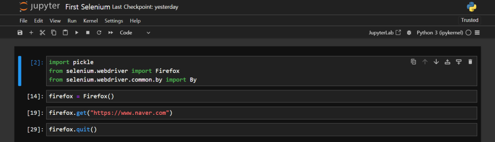
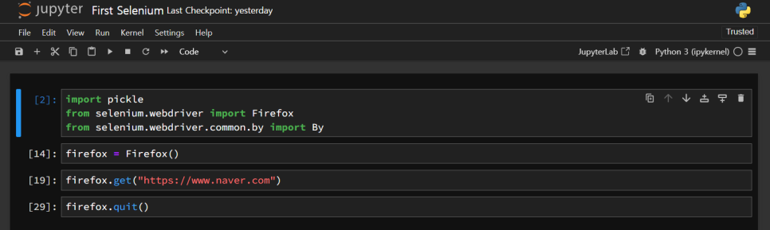

Selenium 을 테스트 하기 위해, Jupyter Notebook 을 설치하였습니다.
한두시간 코딩을 하다보니 글꼴이 눈에 거슬립니다.



어떤 글꼴인지 확인을 해 보았습니다. 맑은고딕, Menlo 를 사용하고 있었습니다.
개인적으로 코딩글꼴은 Source Code Pro 를 선호합니다.
글꼴을 바꾸니 맘이 한결 편해 졌습니다 ㅎ



Jupyter Notebook 에서 글꼴을 바꾸는 방법을 살펴 보도록 하겠습니다.

​글꼴은 아래와 같은 CSS 변수로 관리합니다. 이 값을 원하는 글꼴로 변경하면 됩니다.

```css
--jp-content-font-family
--jp-code-font-family-default
```

Jupyter Notebook 은 설정을 별도로 할 수 있도록 지원합니다.
다음 명령을 입력합니다.
이 명령은 `$HOME/.jupyter` 에 기본 설정을 생성합니다.

```bash
jupyter-notebook --generate-config
```

CSS 설정은 `$HOME/.jupyter/custom/custom.css` 에서 합니다.
디렉토리(또는 폴더)가 없다면 custom 생성하고, 파일을 custom.css 파일에 다음과 같이 글꼴을 설정합니다.

​

:root {

--jp-content-font-family: 'NanumGothicCoding' !important;

--jp-code-font-family-default: 'Source Code Pro' !important;

}

​

같은 설정이 여러군데 있을 때 !important 사용하면, 이 값을 최우선으로 사용합니다.

